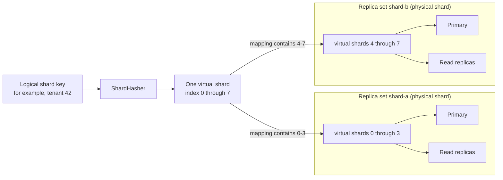

# Topology concepts

This page is a visual guide to the terms used by
[`topology.go`](../topology.go). The main distinction is between **logical
routing** and **physical PostgreSQL endpoints**:

- a shard key is hashed into a virtual shard;
- a virtual shard is mapped to a replica set; and
- the replica set chooses a primary or read replica for the operation.

## Topology at a glance

This example has eight virtual shards placed on two physical shards. A
physical shard is represented in pgmesh by a replica set.



Virtual shards are stable logical buckets, not database servers. Keeping more
virtual shards than physical shards makes it possible to move small groups of
buckets when the physical layout changes. Changing a mapping does not move the
rows; the application must migrate and verify the data before switching it.

## Request-routing flow

The generated `Store` resolves the application value into a shard key. Its
private runtime mesh starts at `ShardHasher` and selects an endpoint:

```mermaid
flowchart TD
    call["Generated Store query"]
    resolver["Generated route calls<br/>application ShardResolver"]
    key["Logical shard key"]
    hash["ShardHasher.Hash(key)"]
    virtualShard["Virtual-shard index"]
    mapping["WithVirtualShardMapping selects<br/>main replica set"]
    kind{"Operation"}
    read["Next read replica<br/>round-robin; primary if none"]
    primaryRead["Main primary"]
    primaryWrite["Write to main primary"]
    mirrors{"Write mirrors?"}
    mirrorWrites["Write to mirror primaries<br/>sequentially and synchronously"]
    result["Return"]

    call --> resolver --> key --> hash --> virtualShard --> mapping --> kind
    kind -->|"default read"| read --> result
    kind -->|"strong read"| primaryRead --> result
    kind -->|"write"| primaryWrite --> mirrors
    mirrors -->|"none"| result
    mirrors -->|"configured"| mirrorWrites --> result
```

A default read can observe replication lag. A strong read explicitly uses the
main primary. Mirrors are an application-level migration mechanism: they are
not read replicas, and a mirror failure does not roll back a successful main
primary write.

## Glossary

| Term | Meaning |
| --- | --- |
| Shard key | A stable application value, such as a tenant ID, used for routing. |
| `ShardHasher` | Maps a shard key to one virtual-shard index in `[0, virtualShardCount)`. |
| Virtual shard | A logical bucket in the mesh routing table. It is not a PostgreSQL endpoint. |
| `Sharded` | Generated topology constructor that receives the virtual-shard count, hasher, resolver, and sharded options. |
| `WithVirtualShardMapping` | Generated functional option assigning virtual-shard indexes to a main replica set and optional write mirrors. |
| `WithReplicaSet` | Generated functional option registering one named primary and zero or more read replicas. |
| Replica set | The internal representation of one physical shard: one primary plus its read replicas. |
| Main replica set | The active replica set that serves reads and primary writes for a mapping. |
| Mirror replica sets | Replica sets whose primaries receive synchronous copies of writes. They do not serve reads for that mapping. |
| Mesh | The private validated table that routes every virtual shard to a replica set. |

Two distinctions prevent most terminology mix-ups:

- A **replica** is one read-only PostgreSQL endpoint. A **replica set** is the
  whole physical shard: its primary and all of its read replicas.
- A **read replica** receives changes through PostgreSQL replication. A **write
  mirror** receives extra writes from the generated pgmesh wrapper, primarily
  during a shard migration.

## Small configuration example

```go
const virtualShardCount = 8

topology := db.Sharded(
    virtualShardCount,
    pgmesh.NewModuloShardHasher[uint64](virtualShardCount),
    tenantResolver{},
    db.WithReplicaSet("shard-a", shardAPrimary),
    db.WithReplicaSet("shard-b", shardBPrimary),
    db.WithVirtualShardMapping("shard-a", pgmesh.VirtualShardRange(0, 4)),
    db.WithVirtualShardMapping("shard-b", pgmesh.VirtualShardRange(4, 8)),
)
```

With this modular hasher, shard key `42` selects virtual shard `2` because
`42 % 8 == 2`. The first mapping then selects replica set `shard-a`.
Signed keys use Euclidean modulo, so `-1` selects virtual shard `7` when there
are eight virtual shards. Named integer types are accepted, and even the
minimum signed value is handled without overflow.

## What `NewStore` does

`NewStore(ctx, topology, options...)` turns the opaque generated topology into
the private runtime objects used on every request:

1. Validate replica-set names, databases, mirror references, and complete
   virtual-shard coverage.
2. Build internal read-only and primary-capable executors for every database.
3. Build each replica set and attach mirror writers to main replica
   sets.
4. Map every virtual-shard index to its configured main replica set.
5. Return the common generated `Store`, or the first topology error.

Continue with [Add sharding](how-to/add-sharding.md) for a complete setup or
[Add read replicas](how-to/add-read-replicas.md) for endpoint-selection details.
